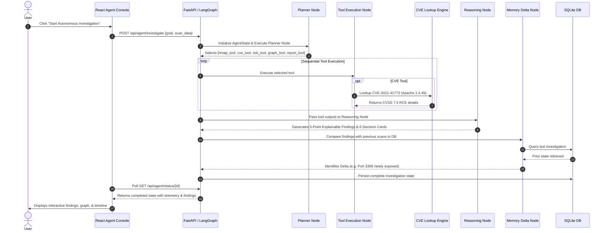

# 🛡️ Sentinel-AI: Complete Developer Guide & Architecture Manual

Welcome to **Sentinel-AI**! This guide is written from the perspective of a beginner developer joining the project. It covers everything you need to understand how the platform works, how data flows through the system, how each frontend page and backend module operates, and how to maintain and debug the codebase without getting lost.

---

# 1. Project Overview

### What Sentinel-AI Does
**Sentinel-AI** is an Autonomous Cyber Defense and Explainable Threat Intelligence Platform. It takes raw network reconnaissance data (such as Nmap scan outputs), identifies running services, correlates them with known vulnerabilities (CVEs), evaluates overall infrastructure risk, models multi-stage adversary attack paths (MITRE ATT&CK), and provides explainable 5-point remediation playbooks for Security Operations Center (SOC) analysts.

### The Problem It Solves
Traditional vulnerability scanners and security dashboards suffer from three major shortcomings:
1. **Alert Fatigue:** Scanners dump hundreds of disconnected CVEs without explaining *why* a particular service is dangerous or *how* an attacker could chain weaknesses together.
2. **Black-Box Confusion:** Automated tools often produce risk scores without transparent, auditable decision logs showing the reasoning behind the assessment.
3. **Manual Analysis Overhead:** SOC engineers spend hours manually correlating port banners, querying the National Vulnerability Database (NVD), and drawing attack graphs by hand.

Sentinel-AI automates this entire pipeline, providing deterministic rule execution alongside an autonomous AI agent engine that plans, executes tools, reasons over findings, and remembers past scans.

### How It Differs From a Normal Vulnerability Scanner
| Feature | Traditional Scanner | Sentinel-AI |
| :--- | :--- | :--- |
| **Analysis Method** | Static signature matching | Autonomous AI Agent + Deterministic Engine |
| **Context Awareness** | Isolated single-port checks | Multi-stage attack chain synthesis & graph relationships |
| **Explainability** | Raw CVE severity numbers | 5-point explainable breakdown (Finding, Root Cause, Evidence, Impact, Remediation) |
| **Auditability** | Opaque scan logs | Auditable Decision Log recording every pipeline step |
| **Historical Memory** | None (scans are isolated) | Cross-investigation memory delta comparing posture changes |
| **Interactivity** | Static PDF/HTML export | Live interactive console, D3 graph explorer, and Ask Sentinel Q&A |

### Two Core Workflows: Upload Scan vs. AI SOC Agent
Sentinel-AI supports two distinct ways to run investigations:
1. **Deterministic Upload Scan Pipeline (`/app/upload`):**
   - A traditional, deterministic, synchronous/background pipeline.
   - Runs a fixed 8-stage sequence: Parser → Rule Engine → Knowledge Base → Risk Engine → Correlation Engine → Attack Chain Builder → Graph Builder → Report Generator.
   - Ideal for predictable, rule-based scanning with sub-second execution.
2. **Autonomous AI SOC Agent Workflow (`/app/agent`):**
   - An intelligent state machine powered by **LangGraph**.
   - Accepts natural language user goals (e.g., *"Find ransomware entry points and correlate CVEs"*).
   - Dynamically plans which tools to run, executes tools in an isolated sandbox, performs deep AI reasoning on tool results, checks cross-investigation memory for posture changes, and supports interactive conversational queries via **Ask Sentinel**.

---

# 2. Complete Architecture Explanation

### The End-to-End Data Flow
```
User Input (Nmap Text / Goal Prompt)
       ↓
Frontend (React 18 + Vite + Tailwind CSS + Lucide Icons)
       ↓  [REST API / JSON Payload]
FastAPI Backend (backend/main.py)
       ↓
┌───────────────────────────────────────────────────────────┐
│                 Security Execution Layer                  │
│                                                           │
│   Deterministic Pipeline         Autonomous LangGraph     │
│   (backend/ai/)                  Agent (backend/agent/)   │
│   ├── Nmap Parser                ├── Planner Node         │
│   ├── Rule Engine                ├── Tool Execution Node  │
│   ├── Risk Engine                ├── Reasoning Node       │
│   ├── MITRE Correlator           └── Memory Node          │
│   ├── Attack Chain Builder               │                │
│   └── Graph Builder                      ▼                │
│                                  Hybrid CVE Service       │
│                                  (backend/services/)      │
│                                  ├── Offline Cache        │
│                                  └── NVD REST API         │
└───────────────────────────────────────────────────────────┘
       ↓
Database Layer (SQLite: backend/database/investigations.db)
       ↓
Frontend Dashboards (Agent Console, Risk, Graph, Attack Chains, Decision Log)
```

### Stage-by-Stage Breakdown

1. **User Input Stage:**
   - The user either uploads raw Nmap terminal text (via `UploadScan.jsx`) or enters a security goal in plain English (via `AgentConsole.jsx`).
2. **Frontend Layer:**
   - React components manage client state and call backend REST APIs via `apiClient.js` and `investigationService.js`.
   - Polling loops track live investigation status and display animated progress bars and timeline steps.
3. **FastAPI Routing Layer:**
   - `backend/main.py` exposes REST endpoints (`/api/upload`, `/api/agent/investigate`, `/api/investigation/{id}/{resource}`, `/api/agent/ask`).
   - Dispatches tasks asynchronously using FastAPI `BackgroundTasks` or `asyncio.create_task`.
4. **Security Engine / Agent Layer:**
   - In deterministic mode: Executes parsing, rule evaluation, risk calculation, MITRE correlation, and attack graph construction sequentially.
   - In agent mode: A LangGraph state graph cycles through Planner → Tool Executor → Reasoner → Memory nodes.
5. **Hybrid CVE Lookup Service:**
   - When software versions are discovered (e.g., `Apache 2.4.49`, `OpenSSH 8.9p1`), the service checks `cve_cache.json`. If unlisted or online lookup is enabled, it queries the live NIST NVD API with automatic rate-limit throttling.
6. **Database Persistence Layer:**
   - All investigation states (hosts, vulnerabilities, tools, graph nodes, decision logs, reports) are stored in SQLite (`investigations.db`) using atomic JSON serialization. Data survives backend and frontend restarts.
7. **Frontend Dashboard Visualization:**
   - Results are rendered in real-time across specialized dashboards: interactive node graphs, attack paths, 5-point explainable finding accordions, risk score gauges, and decision audit logs.

---

# 3. Frontend Pages Explanation

The frontend is located under `frontend/src/pages/` and organized into dedicated views in the navigation sidebar:

```
frontend/src/pages/
├── AgentConsole.jsx         # AI Autonomous Agent Workspace & Q&A
├── DashboardOverview.jsx    # System Health & High-Level Summary
├── UploadScan.jsx           # Raw Nmap Scan Ingestion Pipeline
├── Findings.jsx             # 5-Point Explainable Findings & CVEs
├── AttackChains.jsx         # Multi-Stage Adversary Attack Paths
├── InvestigationGraph.jsx   # Interactive D3 Force-Directed Network Graph
├── DecisionLog.jsx          # Auditable Record of Deterministic & AI Decisions
├── RiskDashboard.jsx        # CVSS Risk Posture, Gauges, & Breakdown
├── Remediation.jsx          # Prioritized Mitigation Guidance Playbooks
├── Reports.jsx              # Executive Summary & Technical Audit Reports
├── Settings.jsx             # System Config, NVD API Key, & LLM Settings
└── LandingPage.jsx          # Marketing & Platform Introduction View
```

---

## 1. AI Agent Mode (`AgentConsole.jsx`)
* **Purpose:** The flagship command center for autonomous AI security investigations.
* **User Workflow:**
  1. The user selects a pre-built security goal (e.g., *"Find ransomware entry points"*, *"Audit public web exposures"*) or enters a custom prompt.
  2. The user pastes optional Nmap scan text or selects mock sample data.
  3. Clicks **"Start Autonomous Investigation"**.
* **What Happens Under the Hood:**
  - The frontend issues `POST /api/agent/investigate`.
  - An interval polls `GET /api/agent/status/{investigation_id}` every 1.5 seconds.
  - A real-time timeline displays active execution steps: **Goal Received → Planning Strategy → Executing Selected Tools → Reasoning & Correlation → Historical Memory Delta → Completed**.
* **Data Displayed:**
  - **Live Timeline:** Visual cards showing tool execution status and durations.
  - **Explainable Findings:** Finding cards with severity pills and 5-point explanations.
  - **Attack Path Preview:** Visual summary of the primary attack vector.
  - **Ask Sentinel Box:** An interactive question-and-answer widget allowing users to ask follow-up questions about the findings (e.g., *"Why is port 22 dangerous?"*).

---

## 2. Dashboard (`DashboardOverview.jsx`)
* **Purpose:** The high-level executive overview of the current investigation.
* **Metrics Shown:**
  - Overall Risk Level badge (Critical, High, Medium, Low, Info).
  - Total Discovered Hosts, Open Services, and Vulnerabilities.
  - Active Attack Paths count.
  - Quick action shortcuts to Graph, Findings, and Remediation.
* **Data Source:** Aggregates data from `GET /api/investigation/{id}/risk-dashboard` and `GET /api/investigation/{id}/investigation-summary`.

---

## 3. Upload Scan (`UploadScan.jsx`)
* **Purpose:** Allows security analysts to ingest raw text outputs from Nmap port scans.
* **Input Accepted:**
  - Standard Nmap scan report text (e.g., `nmap -sV -sC -O 192.168.1.10`).
  - Sample scan data button for rapid demonstration and offline testing.
* **Processing Pipeline:**
  1. Sends scan text via `POST /api/upload`, receiving a unique `investigation_id`.
  2. Initiates deterministic execution via `POST /api/investigation/{id}/start`.
  3. Displays an 8-stage progress tracker until all modules complete.
* **Output Generated:** Redirects the user to the Findings and Graph views.

---

## 4. Findings (`Findings.jsx`)
* **Purpose:** Detailed catalog of all security vulnerabilities and policy violations detected across target hosts.
* **What Findings Represent:**
  - Discovered services running outdated or vulnerable software (e.g., `Apache 2.4.49` with Path Traversal RCE).
  - Dangerous configurations (e.g., Anonymous FTP enabled, Cleartext Telnet, Exposed MySQL).
* **5-Point Explainable Format:**
  Every finding card expands into five structured sections:
  1. **Finding:** Summary of the vulnerability.
  2. **Root Cause (Why):** Underlying software flaw or misconfiguration.
  3. **Verified Evidence:** Exact ports, service banners, and CVE IDs detected.
  4. **Adversary Impact:** Real-world exploit consequence (e.g., Remote Code Execution, Privilege Escalation).
  5. **Remediation:** Actionable mitigation steps.
* **Data Source:** `GET /api/investigation/{id}/findings`.

---

## 5. Attack Chains (`AttackChains.jsx`)
* **Purpose:** Visualizes multi-stage exploit pathways showing how an adversary can progress from external network exposure to full host takeover.
* **How They Are Generated:**
  - The **Attack Chain Builder** (`backend/ai/attack_chain_builder/builder.py`) correlates open ports with vulnerability exploitability and MITRE ATT&CK techniques.
  - Connects stages: **Initial Access → Remote Code Execution → Privilege Escalation → Action on Objectives / Data Exfiltration**.
* **How They Help Analysts:** Shows the *critical path* that defenders must sever first to stop an attacker.

---

## 6. Investigation Graph (`InvestigationGraph.jsx`)
* **Purpose:** An interactive, force-directed network topology and threat correlation graph.
* **Graph Elements:**
  - **Nodes:** Hosts (blue), Services/Ports (teal), Vulnerabilities (amber/red), CVEs (purple), MITRE Techniques (indigo), Remediation Actions (green).
  - **Edges:** Directed relationship lines (`EXPOSES`, `RUNS_SERVICE`, `HAS_VULNERABILITY`, `MAPS_TO_MITRE`, `LEADS_TO_ACCESS`).
* **Interactivity:** Zooming, panning, node dragging, category filtering, search highlighting, and node detail slide-out modal.
* **Data Source:** `GET /api/investigation/{id}/graph`.

---

## 7. Decision Log (`DecisionLog.jsx`)
* **Purpose:** An auditable record of every decision made during the investigation.
* **What Decisions Are Stored:**
  - Stage name (`Parser`, `Rule Engine`, `Risk Engine`, `Correlation Engine`, `Attack Chain Builder`, `Report Generator`).
  - Executive decision description.
  - Rationale ("Why" the decision was taken).
  - Evidence list used to reach the conclusion.
  - Outcome and recommended next step.
  - Confidence rating (`High`, `Medium`, `Low`) and processing time in milliseconds.
* **Special Feature:** **Replay Investigation** overlay that steps through decisions chronologically to explain how the system reached its conclusions.
* **Data Source:** `GET /api/investigation/{id}/decision-log` and `GET /api/investigation/{id}/investigation-summary`.

---

## 8. Risk Dashboard (`RiskDashboard.jsx`)
* **Purpose:** Visual risk scoring and threat distribution metrics.
* **Metrics Displayed:**
  - Overall Risk Score (0 to 100).
  - Severity Breakdown Distribution (Critical, High, Medium, Low, Info).
  - Top 3 High-Risk Findings.
  - Most Dangerous Attack Path breadcrumb.
  - Asset Exposure Gauge.
* **Data Source:** `GET /api/investigation/{id}/risk-dashboard`.

---

## 9. Remediation (`Remediation.jsx`)
* **Purpose:** A prioritized action plan for fixing security issues.
* **Features:**
  - Tasks ordered by priority (Priority 1 = Critical RCE / Host Takeover).
  - Estimated Difficulty indicator (`Easy`, `Medium`, `Hard`).
  - Rationale explaining why fixing this issue reduces the most risk.
  - Quantified Security Improvement benefit.
* **Data Source:** `GET /api/investigation/{id}/remediation`.

---

## 10. Reports (`Reports.jsx`)
* **Purpose:** Formats complete investigation data into an executive summary and technical report.
* **Contents:**
  - Executive Overview & Risk Posture.
  - Target Host & Service Inventory.
  - Technical Vulnerability & CVE Details.
  - MITRE ATT&CK Matrix Alignment.
  - Prioritized Remediation Action Items.
  - Printable layout (`window.print()`) suitable for PDF generation.
* **Data Source:** `GET /api/investigation/{id}/report`.

---

## 11. Settings (`Settings.jsx`)
* **Purpose:** Configuration management for Sentinel-AI.
* **Available Options:**
  - **NVD API Key:** Configure custom NIST API token for higher rate limits.
  - **LLM Engine Provider:** Toggle between Deterministic Rule Engine, Mock AI, OpenAI API, or Local LLM.
  - **Offline CVE Cache:** View local database cache statistics.
  - **Database Management:** Clear stored SQLite investigation history.

---

# 4. Backend Explanation

The backend is built with **FastAPI** (Python 3.11+) and structured into four core directories:

```
backend/
├── main.py                  # Main FastAPI Application, Routes, & Deterministic Pipeline
├── agent/                   # Autonomous LangGraph Agent System
├── ai/                      # Deterministic Cybersecurity Engine Modules
├── services/                # Hybrid CVE Lookup & NIST NVD Client
├── database/                # SQLite Storage Engine & Models
└── tests/                   # Automated Verification Test Suite
```

---

## 1. `backend/agent/` (Autonomous Agent Subsystem)

This folder contains the LangGraph-based autonomous agent engine.

* **`agent_controller.py`:**
  - Manages the lifecycle of autonomous investigations.
  - Exposes `start_autonomous_investigation(goal, scan_data)` to initialize agent state and run the LangGraph workflow.
  - Exposes `get_agent_status(investigation_id)` to construct rich, structured status payloads including `investigation_summary` metrics, 6-stage `decision_log` cards, findings, risk dashboard, attack chains, and remediation.
* **`graph.py`:**
  - Compiles the LangGraph `StateGraph(AgentState)`:
    $$\text{Planner} \longrightarrow \text{Tools} \longrightarrow \text{Reasoner} \longrightarrow \text{Memory} \longrightarrow \text{END}$$
* **`state.py`:**
  - Defines the typed dictionary `AgentState` containing `investigation_id`, `user_goal`, `scan_data`, `discovered_hosts`, `vulnerabilities`, `selected_tools`, `tool_results`, `reasoning_steps`, `final_report`, `memory_insights`, `current_status`.
* **`nodes/planner_node.py`:**
  - Examines the user goal and scan data.
  - Selects the required security tools (e.g., `nmap_analysis_tool`, `vulnerability_lookup_tool`, `risk_analysis_tool`, `attack_graph_tool`, `threat_intelligence_tool`, `report_generation_tool`).
* **`nodes/tool_node.py`:**
  - Sequentially executes the tools selected by the planner.
  - Wraps each tool execution in exception handling to guarantee pipeline stability.
* **`nodes/reasoning_node.py`:**
  - Synthesizes raw tool outputs into explainable findings.
  - Formulates the 5-point explainable intelligence structures and records reasoning steps.
* **`nodes/memory_node.py` & `memory.py`:**
  - Queries past investigations from SQLite.
  - Calculates the delta between the current scan and previous scans (identifying newly opened ports, resolved CVEs, or persisted risks).
* **`ask_sentinel.py`:**
  - Contextual Q&A engine that inspects active findings, attack graphs, and CVEs to provide conversational answers to user questions.
* **`tools/`:**
  - Standalone tool modules:
    - `nmap_analysis_tool.py`: Calls the Nmap parser.
    - `vulnerability_lookup_tool.py`: Queries the hybrid CVE engine.
    - `risk_analysis_tool.py`: Computes risk scores and severity distributions.
    - `attack_graph_tool.py`: Assembles node-link relationship objects.
    - `threat_intelligence_tool.py`: Maps findings to MITRE tactics.
    - `report_generation_tool.py`: Builds executive report summaries.

---

## 2. `backend/ai/` (Deterministic Security Modules)

This folder contains deterministic cybersecurity rules and calculation engines.

* **`parser/nmap_parser.py`:**
  - Regex-based parser that ingests raw Nmap terminal output.
  - Extracts IPv4/IPv6 addresses, hostnames, ports, protocol types (TCP/UDP), port states (`open`, `filtered`), services (`http`, `ssh`, `mysql`), and version strings (`Apache 2.4.49`, `OpenSSH 8.9p1`).
* **`rule_engine/rules.py`:**
  - Catalog of deterministic cybersecurity detection rules (`RULE_001` through `RULE_019`) and knowledge base (`KB_STORE`).
  - Detects vulnerabilities like unauthenticated root access, Path Traversal RCE, TLS 1.0 deprecation, anonymous FTP, exposed databases, and unauthenticated Docker daemons.
* **`risk_engine/risk_calculator.py`:**
  - Evaluates CVSS metrics, accessibility, and host criticality.
  - Computes numerical risk scores ($0 - 100$) and assigns overall risk classifications (`Critical`, `High`, `Medium`, `Low`, `Info`).
* **`correlation_engine/correlator.py`:**
  - Correlates findings with MITRE ATT&CK techniques (e.g., `T1190 - Exploit Public-Facing Application`, `T1021 - Remote Services`).
* **`attack_chain_builder/builder.py`:**
  - Constructs multi-step attack graphs showing attacker progression from entry point to lateral movement.
* **`investigation_graph/builder.py`:**
  - Converts hosts, services, findings, and remediation items into node and edge graph data for D3 visualization.
* **`report_generator/generator.py`:**
  - Compiles final report summaries and executive metrics.

---

## 3. `backend/services/` (Hybrid CVE Lookup Engine)

* **`cve_lookup.py`:**
  - **Offline First:** Checks `backend/data/cve_cache.json` for known vulnerabilities matching service names and versions.
  - **Version Tokenizer (`parse_ver`, `is_vulnerable_version`):** Handles compound version logic (e.g., `2.4.49 to 2.4.50`, `< 8.0.32`, `and prior`).
  - **Online NVD API Fallback:** Queries the NIST NVD 2.0 REST API when unknown services are encountered, handling rate limits and network timeouts gracefully.

---

## 4. `backend/database/` (Storage & Persistence)

* **`db.py`:**
  - SQLite database initializer (`investigations.db`).
  - Executes automatic schema creation and migrations, adding columns (`tool_results`, `explained_findings`, `remediation`, `risk_dashboard`, `investigation_graph`, `attack_chains`, `full_state`) if they do not exist.
* **`models.py`:**
  - `save_investigation(state)`: Persists autonomous agent state dictionaries to SQLite.
  - `save_deterministic_investigation(inv)`: Persists deterministic pipeline investigation objects.
  - `get_investigation_by_id(inv_id)`: Re-hydrates complete state from SQLite, ensuring zero data loss across restarts.
  - `get_all_investigations()` & `delete_investigation(inv_id)`: Historical record handlers.

---

# 5. AI Agent Workflow: Step-by-Step Example

Let's walk through an example execution where a user submits the following prompt:

> **User Goal:** `"Find ransomware entry points and correlate public CVEs"`  
> **Input Scan:** Nmap scan showing Port 22 (SSH OpenSSH 8.9p1), Port 80 (Apache 2.4.49), and Port 3306 (MySQL 8.0.32).



### Detailed Step Description:
1. **Planner Decides Steps (`planner_node.py`):**
   - The planner analyzes the goal keywords (*"ransomware entry points"*, *"CVEs"*) and scans input text.
   - It schedules the execution sequence: `nmap_analysis_tool` → `vulnerability_lookup_tool` → `threat_intelligence_tool` → `risk_analysis_tool` → `attack_graph_tool` → `report_generation_tool`.
2. **Tool Execution Node Runs (`tool_node.py`):**
   - Ingests port 22, 80, and 3306.
   - Executes CVE lookups against Apache 2.4.49, identifying **CVE-2021-41773** (Path Traversal & Remote Code Execution).
   - Maps Apache to MITRE technique **T1190 (Exploit Public-Facing Application)** and MySQL to **T1021.004 (Remote Services)**.
3. **Risk Analysis Executes (`risk_analysis_tool.py`):**
   - Calculates overall risk score as **High / Critical (85/100)** due to unauthenticated remote code execution capabilities on port 80.
4. **Attack Graph & Path Synthesis (`attack_graph_tool.py`):**
   - Constructs the chain: `Internet → Port 80 (Apache RCE) → Host Shell Access → Port 3306 (Database Exfiltration)`.
5. **Reasoning Node Generates Explanations (`reasoning_node.py`):**
   - Packages Apache CVE-2021-41773 into the 5-point format (Root Cause: URI normalization flaw; Evidence: HTTP 2.4.49 banner; Impact: Host compromise; Remediation: Upgrade Apache to $\ge$ 2.4.51).
6. **Memory Node Compares History (`memory_node.py`):**
   - Compares findings against historical database records, detecting whether vulnerabilities are newly introduced or persistent.
7. **Report Generation & State Persistence:**
   - Assembles the final executive summary and persists the entire state object into SQLite (`investigations.db`).

---

# 6. Database Flow & Schema

All persistence is managed in SQLite (`backend/database/investigations.db`).

### What Data Is Stored in SQLite
| Column Name | Type | Description |
| :--- | :--- | :--- |
| `id` | `TEXT PRIMARY KEY` | Unique UUID of the investigation. |
| `user_goal` | `TEXT` | Original user prompt or investigation goal. |
| `status` | `TEXT` | Current execution status (`Investigation Complete`, `Running`, `Error`). |
| `scan_data` | `TEXT` | Raw Nmap scan input text. |
| `discovered_hosts` | `JSON TEXT` | Array of parsed host objects with ports, services, and banners. |
| `vulnerabilities` | `JSON TEXT` | List of detected vulnerabilities and CVE entries. |
| `selected_tools` | `JSON TEXT` | List of tools selected by the Planner Node. |
| `decision_log` | `JSON TEXT` | Array of structured decision audit cards with why rationale and evidence. |
| `final_report` | `JSON TEXT` | Executive report summary object. |
| `tool_results` | `JSON TEXT` | Raw outputs produced by each tool execution. |
| `explained_findings` | `JSON TEXT` | 5-point explainable finding structures. |
| `remediation` | `JSON TEXT` | Prioritized remediation task objects. |
| `risk_dashboard` | `JSON TEXT` | Risk score, severity counts, and distribution percentages. |
| `investigation_graph` | `JSON TEXT` | Graph node and edge arrays for D3 rendering. |
| `attack_chains` | `JSON TEXT` | Multi-stage adversary attack path structures. |
| `full_state` | `JSON TEXT` | Complete serialized JSON state dictionary for full re-hydration. |
| `created_at` | `TIMESTAMP` | Timestamp of investigation creation. |

---

# 7. REST API Documentation

### 1. Upload & Deterministic Pipeline
* **`POST /api/upload`**
  - **Purpose:** Ingest raw Nmap text and create a new investigation record.
  - **Input:** `{"content": "<raw nmap output>"}`
  - **Output:** `{"id": "inv-uuid", "status": "Uploaded", "content": "..."}`
* **`POST /api/investigation/{inv_id}/start`**
  - **Purpose:** Kick off the deterministic 8-stage analysis pipeline in the background.
  - **Input:** None (path parameter `inv_id`).
  - **Output:** `{"status": "started"}`
* **`GET /api/investigation/{inv_id}/status`**
  - **Purpose:** Poll execution progress of a deterministic investigation.
  - **Output:** `{"status": "Investigation Complete", "progress": 100, "isComplete": true}`

### 2. Investigation Resource Endpoints
* **`GET /api/investigation/{inv_id}/{resource}`**
  - **Purpose:** Fetches specific resources for an investigation.
  - **Supported Resources:**
    - `findings` $\rightarrow$ Array of vulnerability finding objects with 5-point explainability.
    - `detected-services` $\rightarrow$ Array of discovered hosts, open ports, and protocols.
    - `graph` $\rightarrow$ Node and edge arrays for the interactive network graph.
    - `attack-chain` $\rightarrow$ Multi-stage attack progression nodes and edges.
    - `decision-log` $\rightarrow$ Complete array of structured decision audit cards.
    - `investigation-summary` $\rightarrow$ Summary metric counters (`servicesDiscovered`, `evidenceCollected`, `findingsGenerated`, `attackChainsBuilt`, `mitreTechniquesMapped`, `decisionCount`).
    - `risk-dashboard` $\rightarrow$ Overall risk score, severity distributions, and top findings.
    - `remediation` $\rightarrow$ Prioritized list of mitigation playbooks.
    - `report` $\rightarrow$ Formatted executive and technical report payload.

### 3. Autonomous AI Agent Endpoints
* **`POST /api/agent/investigate`**
  - **Purpose:** Launch an autonomous LangGraph agent investigation.
  - **Input:** `{"goal": "Find ransomware entry points", "scan_data": "<optional nmap text>"}`
  - **Output:** `{"investigation_id": "inv-uuid", "status": "started"}`
* **`GET /api/agent/status/{investigation_id}`**
  - **Purpose:** Poll live agent status, tool results, timeline step, and generated findings.
  - **Output:** Serialized `AgentState` dictionary with `is_complete: true/false`.
* **`POST /api/agent/ask`**
  - **Purpose:** Ask contextual follow-up questions to the Ask Sentinel engine.
  - **Input:** `{"investigation_id": "inv-uuid", "question": "Why is port 22 dangerous?"}`
  - **Output:** `{"answer": "Port 22 (SSH) is high risk because...", "confidence": "High"}`

---

# 8. How To Debug & Troubleshoot

When debugging Sentinel-AI, follow this quick reference guide:

| Symptom | Probable Cause | Files to Inspect |
| :--- | :--- | :--- |
| **Dashboard / Metrics Show All 0s** | Resource mapping mismatch or missing summary dictionary. | • `backend/main.py` (`get_resource` endpoint)<br>• `backend/agent/agent_controller.py` (`get_agent_status`)<br>• `frontend/src/components/InvestigationSummary.jsx` |
| **Findings List Is Empty** | Nmap parsing failed or rule engine did not match banners. | • `backend/ai/parser/nmap_parser.py`<br>• `backend/ai/rule_engine/rules.py`<br>• `backend/services/cve_lookup.py` |
| **Investigation Graph Not Rendering** | Missing node/edge structure or invalid D3 node kinds. | • `backend/ai/investigation_graph/builder.py`<br>• `frontend/src/pages/InvestigationGraph.jsx` |
| **Decision Log Empty / Replay Fails** | Decisions not recorded in agent state or SQLite serialization issue. | • `backend/agent/agent_controller.py`<br>• `backend/database/models.py`<br>• `frontend/src/pages/DecisionLog.jsx` |
| **Risk Score / Severity Incorrect** | Risk calculator math or CVSS score weight calculation. | • `backend/ai/risk_engine/risk_calculator.py`<br>• `frontend/src/pages/RiskDashboard.jsx` |
| **Agent Hangs on Timeline Step** | Unhandled exception inside a tool execution node. | • `backend/agent/nodes/tool_node.py`<br>• `backend/agent/graph.py` |
| **Data Lost After Server Restart** | SQLite table missing columns or database hydration failed. | • `backend/database/db.py`<br>• `backend/database/models.py` |

---

# 9. Current Project Status

### ✅ Completed & Production Ready:
- **Autonomous LangGraph Agent Engine:** Full state graph with Planner, Tool Execution, Reasoning, and Memory nodes.
- **AI Agent Toolset:** Nmap parser, CVE lookup, risk calculator, attack graph builder, threat intelligence, and report generator.
- **Hybrid CVE Lookup Service:** Offline cache (`cve_cache.json`) + online NIST NVD API fallback.
- **5-Point Explainable AI Findings:** Finding, Root Cause Why, Verified Evidence, Exploitation Impact, Hardening Recommendation.
- **Interactive SOC Agent Console UI:** Real-time execution timeline, finding cards, attack path preview, and Ask Sentinel Q&A.
- **SQLite Investigation State Persistence:** Schema migration and re-hydration across server restarts.
- **Decision Audit Log & Replay:** Auditable decision trail with interactive replay mode.
- **Automated Verification Test Suite:** 5 comprehensive end-to-end integration tests in `backend/tests/test_agent_system.py`.

### 🔄 Working Features:
- Deterministic 8-stage raw Nmap upload pipeline.
- D3-powered force-directed investigation graph.
- MITRE ATT&CK technique correlation.
- Prioritized remediation playbook generator.
- Executive printable reports.

### ⚠️ Known Issues & Workarounds:
- **Large Scan Latency (BUG-004):** Scans exceeding 5,000 lines can cause increased synchronous parsing latency. *Workaround:* Use standard port scans or top 1000 ports.
- **NVD API Rate Limits (BUG-005):** Unauthenticated NVD API calls may encounter HTTP 429 rate limits. *Mitigation:* The system uses the local offline cache first and gracefully returns cached signatures. Users can configure an `NVD_API_KEY` in Settings.

### 🚀 Future Improvements (Roadmap):
- Native local LLM support via Ollama / vLLM for air-gapped environments.
- Direct authorized live Nmap scanner execution via background job queue.
- WebSocket / Server-Sent Events (SSE) streaming for sub-second timeline updates.
- One-click STIX 2.1 and PDF report export.

---

# 10. Beginner Developer Guide: What To Understand First

If you are a new developer joining this project, here are the **four golden rules** to keep in mind before writing code:

1. 📖 **Understand the Dual-Engine Architecture:**
   - Sentinel-AI has two execution pathways: the **Deterministic Pipeline** (`backend/ai/`) and the **Autonomous Agent** (`backend/agent/`).
   - Both pathways produce the same standardized data structures (findings, graphs, decision logs, risk summaries) so the frontend can render them interchangeably.
2. 🔄 **Always Preserve REST Contracts & Data Flow:**
   - The frontend expects specific object schemas (e.g., `InvestigationSummary` expects `servicesDiscovered`, `evidenceCollected`, `findingsGenerated`, etc.).
   - Before modifying any backend endpoint, verify what keys the corresponding React page in `frontend/src/pages/` is consuming.
3. 💾 **Respect SQLite Persistence:**
   - All state is persisted to SQLite via `backend/database/models.py`. If you add new fields to the investigation state, ensure they are serialized to SQLite and restored during hydration in `get_investigation_by_id()`.
4. 🧪 **Run the Automated Test Suite Before Submitting Changes:**
   - Whenever you make changes to the backend or agent logic, always run the automated verification test suite:
     ```powershell
     backend\venv\Scripts\python.exe backend/tests/test_agent_system.py
     ```
   - Make sure all verification tests pass!
